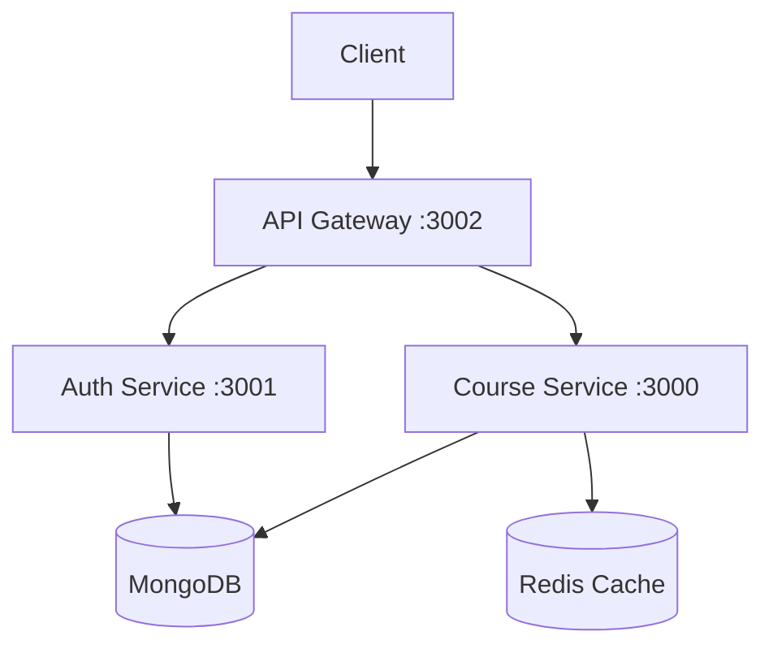
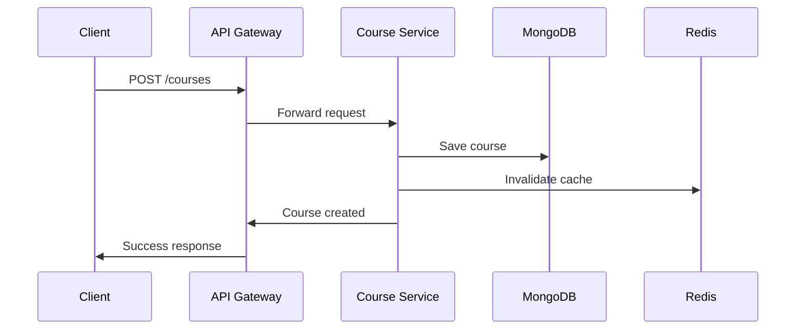
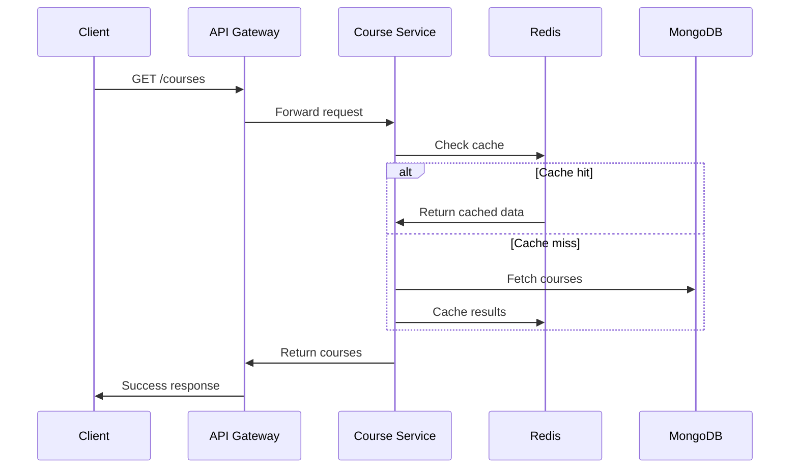

# E-Learning API Architecture

## System Architecture

## Component Overview

### API Gateway (Port 3002)
- Routes requests to appropriate microservices
- Handles service discovery
- Load balancing
- Request/Response transformation

### Course Service (Port 3000)
- Course CRUD operations
- Data validation
- Redis caching implementation
- MongoDB integration
- Error handling

### Auth Service (Port 3001)
- User authentication
- Authorization
- JWT token management
- User management

### Data Layer
- MongoDB: Primary database
- Redis: Caching layer

## Data Flow

1. **Course Creation**

2. **Course Retrieval**

## Security

- Input validation using class-validator
- Global exception handling
- Rate limiting (planned)
- JWT authentication (planned)
- CORS enabled
- Environment variable configuration

## Scalability

The microservices architecture allows for:
- Independent scaling of services
- Easy addition of new services
- Load balancing
- Service redundancy
- Zero-downtime deployments
